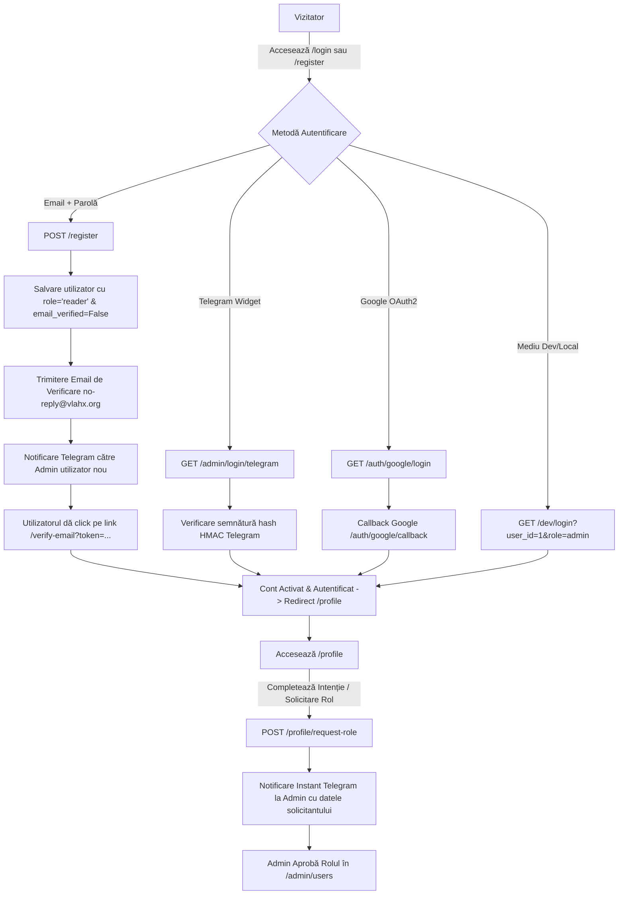
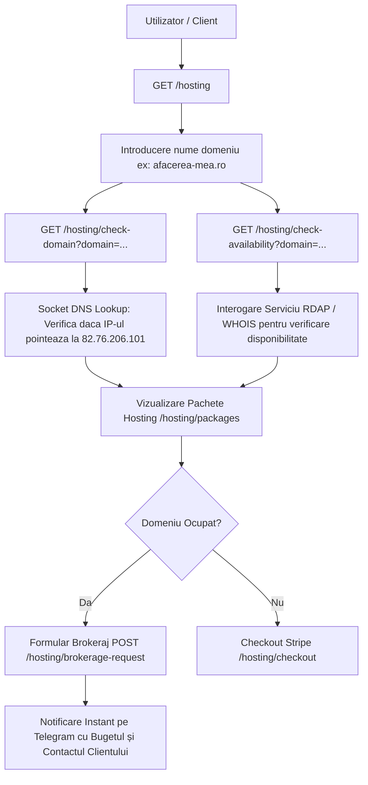

# Documentație Tehnică VlahX Core 2.0 (`vlahx.md`)
## Ghid de Arhitectură, Fluxuri Funcționale și Matricea API Swagger/OpenAPI

Acest fișier reprezintă documentația tehnică oficială și completă a platformei **VlahX Core 2.0**, fiind structurat special atât pentru **Dezvoltatori** (arhitectură, rute, parametri, integrări, plugin-uri), cât și pentru **Administratori** (fluxuri de lucru, roluri, moderare, configurare site, hosting).

---

## 1. Arhitectură Generală & Tehnologii Core

Platforma **VlahX Engine 2.0** este proiectată ca un micro-cadru monolitic modular (Plugin-Driven Architecture) bazat pe următoarele tehnologii principale:

* **Backend & Web Framework**: Python 3.10+ cu **FastAPI** pentru routing asincron de mare viteză și generare automată a specificațiilor OpenAPI/Swagger.
* **ORM & Bază de Date**: **SQLAlchemy** conectat la **SQLite** (`db/app.db`).
* **Templating & UI Rendering**: **Jinja2 Templates** cu randare pe server (SSR), susținut de interfețe moderne responsive (Bootstrap 5, Vanilla CSS3, JavaScript modular).
* **Autentificare & Sesiuni**: `starlette.middleware.sessions.SessionMiddleware` cu secrete configurabile în mediu și suport multi-provider (Autentificare Clasic cu Email + Parolă, Telegram OAuth Widget, Google OAuth2, Dev Login & SSO Tokens).
* **Internaționalizare (i18n)**: Sistem hibrid JSON file-based (`app/locales/ro.json`, `app/locales/en.json`) combinat cu suprascrieri dinamice în baza de date SQLite (`TranslationEntry`).

### Structura Directorilor Proiectului (`/opt/devapp`)

```text
/opt/devapp/
├── app/
│   ├── core/                  # Utilitare core (config, events, i18n, plugin_manager, template_hooks)
│   ├── models/                # Modele ORM SQLAlchemy (Post, User, Category, MediaFile, AppSetting, etc.)
│   ├── routers/               # Ruterele principale FastAPI (auth, admin, blog, media, hosting, plugin_settings, api)
│   ├── plugins/               # Modul de plugin-uri (comments, devstudio, minishop, newsletter, robots_sitemap, etc.)
│   ├── static/                # Fișiere statice (CSS, JS, upload-uri media ale utilizatorilor)
│   ├── templates/             # Șabloane Jinja2 (admin/, blog/, hosting/, user/)
│   └── utils/                 # Ajutoare (auth, db, telegram, post_image, check_availability)
├── db/                        # Baza de date SQLite (db/app.db)
├── docs/                      # Ghiduri și documentație tehnică (vlahx.md, TODO.md, RULES.md, etc.)
├── main.py                    # Punctul de intrare FastAPI (create_app, inregistrare rutere & middleware)
└── requirements.txt           # Dependențe Python
```

---

## 2. Sistemul de Roluri & Permisiuni

Accesul la nivelul întregii aplicații este reglementat de decoratorii `@login_required` și `@role_required(...)` definiți în `app/utils/auth.py`. Rolurile disponibile în sistem sunt:

| Rol | Permisiuni & Nivel de Acces |
| :--- | :--- |
| **`admin`** | Acces total neobstrucționat: panou admin, setări site, utilizatori, teme, plugin-uri, comentarii, restart app, DevStudio. |
| **`editor`** | Poate gestiona toate articolele, categoriile, mediile și comentariile tuturor autorilor. Fără acces la setări sistem/utilizatori. |
| **`author`** | Poate crea, edita și șterge doar propriile articole și fișiere media încărcate. |
| **`seller`** | Acces extins pentru administrarea magazinului online (`minishop`) și gestionarea produselor/comenzilor. |
| **`developer`**| Acces la **DevStudio Web IDE**, dreptul de a crea/edita teme și plugin-uri, precum și acces SSO pe `repo.vlahx.org`. |
| **`reader` / `user`**| Utilizator autentificat standard: poate vizualiza profilul personal, lăsa comentarii, plasa comenzi și solicita roluri noi. |
| **`pending`** | Cont în așteptare (ex: email neverificat sau cont blocat temporar). Nu poate publica articole sau comentarii. |

---

## 3. Fluxurile Aplicației (End-to-End Workflows)

### 3.1 Fluxul 1: Autentificare, Onboarding & Management Profil (Auth Flow)



#### Pașii detaliați ai fluxului de Auth:
1. **Înregistrare Clasic (Email + Parolă)**:
   - Utilizatorul trimite formularul la `POST /register`.
   - Sistemul validează unicitatea adresei de email, generează un `verification_token` UUID4 și salvează utilizatorul ca `role="reader"` cu `email_verified=False`.
   - Se trimite automat o **Notificare pe Telegram către Admin** cu detaliile noului cont.
   - Se trimite un email de activare. Utilizatorul accesează `GET /verify-email?token=...`, contul devine verificat, iar sesiunea este activată cu redirect către `/profile`.
2. **Autentificare Social / OAuth**:
   - **Telegram**: Folosește widget-ul oficial Telegram. La callback-ul `GET /admin/login/telegram`, se verifică SHA256 HMAC cu token-ul botului. Primul utilizator înregistrat în sistem primește automat rolul `admin`.
   - **Google**: Redirecționează către Google OAuth2 consent screen (`GET /auth/google/login`). Callback-ul `GET /auth/google/callback` obține access token-ul, preia profilul și autentifică utilizatorul.
3. **Solicitare Roluri (Developer, Seller, Author, Editor)**:
   - În profilul personal (`/profile`), utilizatorul poate alege o intenție de onboarding sau trimite o solicitare de rol prin `POST /profile/request-role`.
   - Cererea trimite o notificare detaliată pe Telegram administratorului, iar statusul pentru dezvoltator trece în `dev_status = "pending"`. Administratorul poate aproba sau respinge din `/admin/users`.

---

### 3.2 Fluxul 2: Panoul de Administrare & Operățiuni (Admin Operations Flow)

```mermaid
flowchart TD
    A[Admin / Editor Autentificat] --> B[GET /admin Dashboard]
    B --> C1[Articole: GET /admin/new & POST /admin/save]
    B --> C2[Categorii: GET /admin/categories & POST /admin/categories/save]
    B --> C3[Utilizatori & Roluri: GET /admin/users & POST /admin/users/{id}/role]
    B --> C4[Setări Site: GET /admin/settings & POST /admin/settings/save]
    B --> C5[Teme & Plugin-uri: Upload ZIP, Activare, Repo Install]
    B --> C6[Traduceri i18n: Editează chei & Limbi]
    B --> C7[Repornire Aplicație: POST /admin/app/restart]
```

#### Operățiuni Cheie în Panoul de Administrare:
* **Management Articole & Pagini Statice**:
  - `GET /admin/new` randează editorul de articole.
  - `POST /admin/save` primește titlul, rezumatul, conținutul HTML, categoria, imaginea Hero/Thumbnail, starea de ciornă (`draft`), meta-keywords și opțiunea de pagină statică. La bifarea opțiunii de pagină statică (`nav_fixed`), se poate alege dinamic opțiunea de plasare a link-ului (`nav_location`: 🧭 Navbar sus, 🦶 Footer subsol, sau 🌐 Ambele). Dacă slug-ul nu este specificat, se generează automat din titlu via `slugify()`.
  - Imaginile pot fi încărcate prin drag-and-drop sau selectate din biblioteca Media.
* **Management Setări Site (`AppSetting`)**:
  - `/admin/settings` permite modificarea numelui site-ului, sloganului, modul primului ecran (`HOMEPAGE_MODE`: feed articole, pagină statică `page:<slug>` sau shop), link-urilor din meniul de navigare (cu introducerea etichetelor per limbă activă `labels: {"ro": "...", "en": "..."}` și alegerea locației Navbar/Footer/Ambele), precum și încărcarea imaginilor de brand/favicon/OG card.
* **Teme, Plugin-uri & Repository**:
  - Pachetele `.zip` de teme sau plugin-uri pot fi încărcate manual (`/admin/themes/upload`, `/admin/plugins/upload`) sau instalate cu 1-click din magazinul oficial via `/admin/themes/repo/install` și `/admin/plugins/repo/install`.

---

### 3.3 Fluxul 3: Front-End Public, Blog Engine & Serviciul Media (Public & Media Flow)

```mermaid
flowchart TD
    A[Vizitator Public] --> B[GET /]
    B -->|Check HOMEPAGE_MODE| C{Mod Setat}
    C -->|blog| D[Randează Feed Articole / index.html]
    C -->|page:slug| E[Servește Pagină Statică / serve_blog_post]
    C -->|shop| F[Redirect /shop]

    D --> G[Vizualizare Articol GET /{slug} sau /blog/{slug}]
    G --> H[Randare Articol + Metatag-uri SEO/OpenGraph + Sub-șabloane Plugin-uri]
    H --> I[Sistem Comentarii: GET / POST /api/comments/add]
    I -->|Trigger AI Author| J[Background Worker generează răspuns automat AI]

    K[Upload Fișiere Media] --> L[POST /api/media/upload]
    L --> M[Optimizare Pillow: Resizing, Exif Transpose, Crop OG 1200x630 / Square]
    M --> N[Salvare în static/uploads/users/{user_id}/ & Înregistrare în DB MediaFile]
```

#### Caracteristici specifice Engine-ului Public:
* **Routing Dinamic Prima Pagină**: Ruterul rădăcină `GET /` detectează setarea `HOMEPAGE_MODE` stocată în baza de date. Dacă este configurat `page:despre-noi`, randează pagina statică corespunzătoare păstrând URL-ul `/`.
* **Serviciul Media (`/api/media/*`)**:
  - Permite încărcarea fișierelor de către utilizatorii autentificați (`blog`, `shop`, `general`).
  - Procesare automată Pillow: elimină profilul EXIF, convertește culorile transparente pe fundal alb, resize automat pentru rezoluții mari și decupare raport 1200x630 (OG Card) sau 1:1 (pătrat).
* **Sistemul de Comentarii**:
  - Suportă comentarii ierarhice (reply la nivel infinit).
  - La adăugarea unui comentariu aprobat, se declanșează asincron plugin-ul `vlahx_ai_author` pentru a genera un răspuns contextual automat din partea autorului AI.

---

### 3.4 Fluxul 4: Hosting & Brokeraj Domenii (Hosting Flow)



---

### 3.5 Fluxul 5: Cloud DevStudio & Web IDE (Developer Flow)

```mermaid
flowchart TD
    A[Utilizator cu rol 'developer' sau 'admin'] --> B[Accesează /admin/plugins/devstudio]
    B --> C[Panoul SPV: Afișează Proiectele din storage/workspaces/{handle}/]
    C --> D[Deschidere Web IDE: /admin/plugins/devstudio/ide?folder=my-theme]
    D --> E[Editare Fișiere: HTML, Jinja2, JSON, Python]
    E --> F[Verificare Sintaxă & Linting Jinja2/JSON/Python în Timp Real]
    F --> G[Salvare Fișier: POST /admin/plugins/devstudio/api/save-file]
    G --> H[Publicare 1-Click în Teme/Plugin-uri Active ale Site-ului]
```

---

## 4. Matricea Completă a Endpoint-urilor Swagger / OpenAPI

Mai jos este lista tuturor rutelor API expuse de platforma **VlahX Core 2.0**, grupate pe categorii, împreună cu metodele HTTP, rolurile necesare, parametrii acceptați și codurile de răspuns.

### 4.1 Autentificare & Utilizatori (Tag: `auth`)

| Metodă | Cale URL (Endpoint) | Rol / Permisiuni | Parametri Acceptați (Form / Query) | Răspuns & Descriere |
| :--- | :--- | :--- | :--- | :--- |
| **`GET`** | `/login` / `/admin/login` | Public | `msg`, `err` (Query) | `200 HTML` — Randează pagina de conectare (Email, Telegram, Google). |
| **`POST`**| `/login` | Public | `email`, `password` (Form) | `303 Redirect` — Autentificare cu email/parolă. Redirecționează la `/profile`. |
| **`GET`** | `/register` | Public | `msg`, `err` (Query) | `200 HTML` — Formular de înregistrare cont nou. |
| **`POST`**| `/register` | Public | `email`, `password`, `first_name`, `last_name` | `303 Redirect` — Înregistrează contul, trimite email activare & notificare Telegram. |
| **`GET`** | `/verify-email` | Public | `token` (Query) | `303 Redirect` — Validează token-ul de email și activează contul. |
| **`GET`** | `/dev/login` | Public (Dev) | `user_id`, `role`, `target` (Query) | `303 Redirect` — Autentificare rapidă/elevare rol în mediul de dezvoltare. |
| **`GET`** | `/auth/google/login` | Public | `next` (Query) | `303 Redirect` — Inițiază fluxul Google OAuth2. |
| **`GET`** | `/auth/google/callback` | Public | `code` (Query) | `303 Redirect` — Callback OAuth2 Google; creează/autentifică utilizatorul. |
| **`GET`** | `/admin/login/telegram` | Public | Semnătură hash Telegram (Query) | `303 Redirect` — Callback Telegram Login Widget; verifică autenticitatea HMAC. |
| **`GET`** | `/profile` | Autentificat | — | `200 HTML` — Randează pagina de profil, istoricul comenzilor și setările de rol. |
| **`POST`**| `/profile/update` | Autentificat | `first_name`, `last_name`, `email`, `phone`, `bio`, `avatar_file` | `303 Redirect` — Actualizează datele personale și avatarul utilizatorului. |
| **`POST`**| `/profile/request-role`| Autentificat | `requested_role`, `motivation` (Form) | `303 Redirect` — Solicită rol nou și trimite notificare instant pe Telegram la Admin. |
| **`GET`** | `/user/{user_id}` | Public | `user_id` (Path) | `200 HTML` — Afișează profilul public al unui utilizator. |
| **`GET`** | `/auth/logout` / `/admin/logout` | Autentificat | — | `303 Redirect` — Șterge sesiunea și deconectează utilizatorul. |

---

### 4.2 Panou de Administrare (Tag: `admin`)

| Metodă | Cale URL (Endpoint) | Rol / Permisiuni | Parametri Acceptați | Răspuns & Descriere |
| :--- | :--- | :--- | :--- | :--- |
| **`GET`** | `/admin` | `admin`, `editor`, `author` | — | `200 HTML` — Dashboard-ul principal de administrare. |
| **`GET`** | `/admin/users` | `admin` | `msg`, `err` (Query) | `200 HTML` — Lista tuturor utilizatorilor și rolurilor. |
| **`POST`**| `/admin/users/{user_id}/role` | `admin` | `role` / `roles` (Form) | `303 Redirect` — Modifică rolul sau lista de roluri a utilizatorului. |
| **`POST`**| `/admin/users/{user_id}/approve-developer` | `admin` | — | `303 Redirect` — Aprobă cererea de rol `developer`. |
| **`POST`**| `/admin/users/{user_id}/reject-developer` | `admin` | — | `303 Redirect` — Respinge cererea de rol `developer`. |
| **`POST`**| `/admin/users/{user_id}/delete` | `admin` | — | `303 Redirect` — Șterge definitiv un utilizator din sistem. |
| **`GET`** | `/admin/new` | `admin`, `editor`, `author` | — | `200 HTML` — Formular creare articol / pagină statică nouă. |
| **`GET`** | `/admin/edit/{slug}` | `admin`, `editor`, `author` | `slug` (Path) | `200 HTML` — Formular editare articol existent. |
| **`POST`**| `/admin/save` | `admin`, `editor`, `author` | `title`, `content_html`, `excerpt`, `category`, `draft`, `is_static_page`, etc. | `303 Redirect` — Salvează/actualizează un articol sau o pagină statică. |
| **`GET`** | `/admin/post/{slug}/delete` | `admin`, `editor`, `author` | `slug` (Path) | `303 Redirect` — Șterge un articol. |
| **`GET`** | `/admin/categories` | `admin`, `editor` | — | `200 HTML` — Lista categoriilor de articole. |
| **`POST`**| `/admin/categories/save` | `admin`, `editor` | `name`, `description` (Form) | `303 Redirect` — Adaugă sau editează o categorie. |
| **`POST`**| `/admin/categories/delete` | `admin`, `editor` | `category_id` (Form) | `303 Redirect` — Șterge o categorie. |
| **`GET`** | `/admin/settings` | `admin` | — | `200 HTML` — Panoul setărilor globale ale site-ului. |
| **`POST`**| `/admin/settings/save` | `admin` | Setări cheie-valoare site | `303 Redirect` — Salvează setările globale în tabela `AppSetting`. |
| **`POST`**| `/admin/settings/upload-image` | `admin` | `target_key`, `image_file` (File) | `303 Redirect` — Încarcă imagini de brand/favicon/OG card. |
| **`GET`** | `/admin/translations` | `admin` | — | `200 HTML` — Interfața de gestionare i18n & traduceri limbi. |
| **`POST`**| `/admin/translations/save` | `admin` | Formular chei traduceri | `303 Redirect` — Salvează traducerile în baza de date SQLite. |
| **`GET`** | `/admin/themes` | `admin` | — | `200 HTML` — Lista temelor instalate și tema activă. |
| **`POST`**| `/admin/themes/activate` | `admin` | `theme_id` (Form) | `200 HTML` — Activează o temă vizuală. |
| **`POST`**| `/admin/themes/upload` | `admin` | `theme_zip` (File) | `200 HTML` — Încarcă și instalează o temă dintr-o arhivă `.zip`. |
| **`GET`** | `/admin/plugins` | `admin` | — | `200 HTML` — Lista plugin-urilor instalate. |
| **`POST`**| `/admin/plugins/upload` | `admin` | `plugin_zip` (File) | `200 HTML` — Încarcă și instalează un plugin din `.zip`. |
| **`POST`**| `/admin/app/restart` | `admin` | — | `200 HTML` — Emite semnal de repornire container/proces (`SIGTERM`). |

---

### 4.3 Blog & Conținut Public (Tag: `blog`)

| Metodă | Cale URL | Rol / Permisiuni | Parametri Acceptați | Răspuns & Descriere |
| :--- | :--- | :--- | :--- | :--- |
| **`GET`** | `/` | Public | `category`, `author`, `q` (Query) | `200 HTML` — Randerizor dinamic (Blog Feed, Pagină Statică sau Shop în funcție de `HOMEPAGE_MODE`). |
| **`GET`** | `/blog` | Public | `category`, `author`, `q` (Query) | `200 HTML` — Feed-ul standard de articole ale blogului. |
| **`GET`** | `/blog/{slug}` / `/{slug}` | Public | `slug` (Path) | `200 HTML` — Randează articolul individual sau pagina statică. |
| **`GET`** | `/category/{category_slug}`| Public | `category_slug` (Path) | `200 HTML` — Filtrează articolele dintr-o anumită categorie. |
| **`GET`** | `/search` | Public | `q` sau `search` (Query) | `200 HTML` — Căutare articole după cuvinte cheie. |
| **`POST`**| `/lang` | Public | `locale`, `next` (Form/Query) | `303 Redirect` — Schimbă limba activă a sesiunii (setare cookie `blog_locale`). |

---

### 4.4 Media Engine & API Fișiere (Tag: `media`)

| Metodă | Cale URL | Rol | Parametri Acceptați | Răspuns & Descriere |
| :--- | :--- | :--- | :--- | :--- |
| **`GET`** | `/api/media/files` | Autentificat | `category`, `search` (Query) | `200 JSON` — Returnează lista fișierelor media încărcate. |
| **`POST`**| `/api/media/upload` | Autentificat | `category`, `upload_files` (Files) | `200 JSON` — Încarcă imagini, le optimizează cu Pillow și le salvează pe disc. |
| **`POST`**| `/api/media/delete` | Autentificat | `file_id` (Form) | `200 JSON` — Șterge un fișier media de pe disc și din DB. |
| **`POST`**| `/api/media/crop` | Autentificat | `file_id`, `preset`, `width`, `height` | `200 JSON` — Decupează dinamic o imagine (Preset: `og` 1200x630, `square` 500x500). |

---

### 4.5 Hosting & Domenii (Tag: `hosting`)

| Metodă | Cale URL | Rol | Parametri Acceptați | Răspuns & Descriere |
| :--- | :--- | :--- | :--- | :--- |
| **`GET`** | `/hosting` | Public | `domain` (Query) | `200 HTML` — Pagina principală a serviciului de hosting VlahX. |
| **`GET`** | `/hosting/check-domain` | Public | `domain` (Query) | `200 JSON` — Verifică prin socket DNS dacă domeniul indică spre IP-ul `82.76.206.101`. |
| **`GET`** | `/hosting/check-availability`| Public | `domain` (Query) | `200 JSON` — Verifică disponibilitatea domeniului prin protocolul RDAP. |
| **`GET`** | `/hosting/packages` | Public | `domain`, `own` (Query) | `200 HTML` — Afișează pachetele de hosting disponibile. |
| **`GET`** | `/hosting/checkout` | Public | `pkg`, `domain` (Query) | `200 HTML` — Pagina de checkout & activare hosting. |
| **`POST`**| `/hosting/brokerage-request`| Public/User | `domain`, `budget`, `phone`, `notes` | `303 Redirect` — Trimite o cerere de brokeraj pentru domeniu ocupat (Notificare Telegram instant la Admin). |

---

### 4.6 Plugin Settings (Tag: `plugin_settings`)

| Metodă | Cale URL | Rol | Parametri Acceptați | Răspuns & Descriere |
| :--- | :--- | :--- | :--- | :--- |
| **`GET`** | `/admin/plugins/{plugin_id}/settings` | `admin` | `plugin_id` (Path) | `200 HTML` — Panoul de configurare al unui plugin. |
| **`POST`**| `/admin/plugins/{plugin_id}/settings` | `admin` | Setările specifice din `plugin.json` | `200 HTML` — Salvează setările plugin-ului în baza de date. |
| **`POST`**| `/admin/plugins/{plugin_id}/toggle` | `admin` | `enabled` (Form) | `200 HTML` — Activează sau dezactivează un plugin. |
| **`POST`**| `/api/comments/add` | Autentificat | `post_slug`, `content`, `parent_id` | `200 JSON` — Adaugă un comentariu (Plugin Comentarii). |

---

### 4.7 Cloud DevStudio & Web IDE (Tag: `devstudio`)

| Metodă | Cale URL | Rol | Parametri Acceptați | Răspuns & Descriere |
| :--- | :--- | :--- | :--- | :--- |
| **`GET`** | `/admin/plugins/devstudio` | `developer`, `admin` | — | `200 HTML` — Panoul SPV (Workspace-ul de dezvoltare al utilizatorului). |
| **`GET`** | `/admin/plugins/devstudio/ide` | `developer`, `admin` | `folder` (Query) | `200 HTML` — Web IDE-ul pentru editare cod teme/plugin-uri în browser. |
| **`GET`** | `/admin/plugins/devstudio/api/tree` | `developer`, `admin` | `folder` (Query) | `200 JSON` — Arborele de fișiere și directoare din proiect. |
| **`POST`**| `/admin/plugins/devstudio/api/read-file` | `developer`, `admin` | `folder`, `rel_path` (Form) | `200 JSON` — Citește conținutul unui fișier în IDE. |
| **`POST`**| `/admin/plugins/devstudio/api/save-file` | `developer`, `admin` | `folder`, `rel_path`, `code` (Form) | `200 JSON` — Salvează fișierul pe disc cu linter Jinja2/Python/JSON automat. |
| **`POST`**| `/admin/plugins/devstudio/api/publish` | `developer`, `admin` | `folder` (Form) | `200 JSON` — Publică 1-Click tema/plugin-ul din workspace în producție. |

---

### 4.8 Core API & Monitoring (Tag: `default`)

| Metodă | Cale URL | Rol | Parametri | Răspuns & Descriere |
| :--- | :--- | :--- | :--- | :--- |
| **`GET`** | `/api/` | Public | — | `200 JSON` — Informații despre serviciu. |
| **`GET`** | `/api/status` | Public | — | `200 OK / 503 Service Unavailable` — Endpoint de Health-Check pentru verificare conexiune SQLite. |

---

## 5. Ghid de Referință pentru Administrare & Dezvoltare

### 5.1 Ghid pentru Administratori

1. **Prima Instalare & Creare Cont Admin**:
   - Primul utilizator care se autentifică pe site via Telegram sau Google primeste automat rolul de **`admin`**.
   - În mediu local de testare, accesați `/dev/login?user_id=1&role=admin` pentru acces direct.
2. **Configurare Inițială Site**:
   - Mergeți la `/admin/settings` și setați Numele Site-ului, Sloganul și încărcați Logo-ul Brandului și Favicon-ul.
   - Alegeți modul primei pagini (`HOMEPAGE_MODE`): `blog` (articole) sau `page:despre-noi` (pagină statică).
3. **Notificări Telegram**:
   - Setați `TELEGRAM_BOT_TOKEN` și `TELEGRAM_NOTIFY_CHAT_ID` în mediu sau în setările plugin-ului `telegram_notify`. Veți primi notificări instant pe Telegram la: înregistrări utilizatori noi, solicitări de roluri noi, cereri de brokeraj domenii și comentarii noi.
4. **Instalare Teme & Plugin-uri**:
   - Accesați `/admin/themes` sau `/admin/plugins` pentru a încărca fișiere `.zip` sau pentru a instala pachete din magazinul comunității cu 1-click.

---

### 5.2 Ghid pentru Dezvoltatori (Extindere VlahX Engine)

1. **Crearea unui Plugin Nou**:
   - Creați un folder în `app/plugins/<nume_plugin>/`.
   - Adăugați fișierul `plugin.json`:
     ```json
     {
       "name": "Plugin-ul Meu",
       "version": "1.0.0",
       "description": "Descriere plugin...",
       "author": "Nume Dezvoltator",
       "settings": {
         "api_key": { "type": "text", "label": "Cheie API", "default": "" }
       }
     }
     ```
   - Adăugați logica în `plugin.py`:
     ```python
     from fastapi import FastAPI
     from app.core.plugin_manager import get_plugin_setting

     def register(app: FastAPI, plugin_id: str = "nume_plugin") -> None:
         @app.get("/api/my-plugin-route")
         async def my_route():
             api_key = get_plugin_setting(plugin_id, "api_key")
             return {"status": "ok", "key": api_key}
     ```
2. **Utilizarea Hook-urilor de Șablon (`app/core/template_hooks.py`)**:
   - Puteți injecta elemente în interfața Admin sau în subsolul articolelor:
     ```python
     from app.core.template_hooks import register_admin_nav, register_post_article_footer

     register_admin_nav(lambda req: '<li class="nav-item"><a class="nav-link" href="/admin/my-plugin">🚀 Noul Meu Plugin</a></li>')
     ```
3. **Utilizarea Web IDE (DevStudio)**:
   - Utilizatorii cu rol de `developer` pot edita codul sursă direct din browser la `/admin/plugins/devstudio/ide` având verificare de sintaxă în timp real și posibilitate de publicare 1-click.
